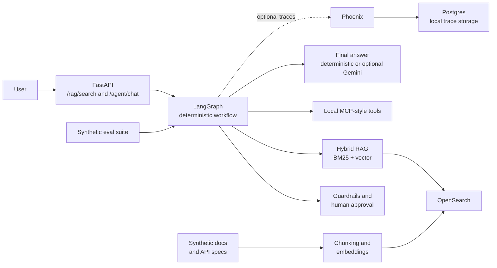

# Enterprise API Intelligence Agent

## Project Overview

Enterprise API Intelligence Agent is an enterprise-style portfolio proof of
concept inspired by API governance, MCP/tooling, and regulated AI patterns. It
answers questions over synthetic API documentation, exposes controlled local
tools, and pauses mock change actions for human approval.

The project uses fictional API specifications and runbooks only. It does not
contain internal company data or connect to real enterprise systems.

## What Problem It Solves

API consumers need answers that combine exact technical details, such as paths
and API names, with broader policy and operational context. This project
demonstrates how an agent can:

- retrieve grounded evidence from API documentation;
- call structured tools without hiding side effects;
- enforce approval and guardrail decisions; and
- expose traces and repeatable evaluations for engineering review.

## Architecture



The API currently keeps session and approval metadata in a local repository
implementation; a Postgres-backed operational repository is a production
extension.

## Tech Stack

| Area | Technology |
| --- | --- |
| API service | Python 3.11, FastAPI, Pydantic |
| Agent workflow | LangGraph with deterministic routing |
| Answer synthesis | Deterministic by default; optional Google Gemini |
| Tool interface | MCP Python SDK with local synthetic tools |
| Retrieval | OpenSearch hybrid keyword/vector search |
| Embeddings | Sentence Transformers or deterministic `local_hashing` fallback |
| Demo UI | Streamlit client for the local FastAPI service |
| Local infrastructure | Docker Compose, Postgres, Phoenix |
| Quality | pytest, Ruff, synthetic evaluation suite |

## Key AI Engineering Features

| Feature | Purpose |
| --- | --- |
| Hybrid RAG | Combines BM25 exact matching with vector retrieval for technical and semantic questions. |
| MCP-style tools | Provides typed local capabilities for catalogue search, spec validation, and mock changes. |
| LangGraph orchestration | Makes routing, retrieval, tool execution, approval, and final response steps testable. |
| Human approval | Prevents approval-gated mock change requests from executing immediately. |
| Guardrails | Rejects restricted requests and requires sources for documentation-based factual answers. |
| Tracing | Optionally exports safe workflow metadata to local Phoenix or managed LangSmith. |
| Evaluations | Runs a 20-question synthetic baseline for route, source, tool, approval, and groundedness metrics. |
| Optional synthesis | Uses Gemini only to phrase final grounded answers when explicitly configured. |

## How To Run Locally

Requirements: [uv](https://docs.astral.sh/uv/), Python 3.11, and Docker
Compose for the local infrastructure stack.

```bash
cp .env.example .env
uv sync --dev
docker compose up --build -d
curl http://127.0.0.1:8000/health
uv run pytest
```

Local services:

| Service | Address |
| --- | --- |
| FastAPI and Swagger UI | `http://127.0.0.1:8000` and `http://127.0.0.1:8000/docs` |
| OpenSearch | `http://127.0.0.1:9200` |
| Postgres | `127.0.0.1:5432` |
| Phoenix | `http://127.0.0.1:6006` |

To run the API process directly while infrastructure remains containerized:

```bash
uv run uvicorn app.main:app --reload
```

## Quick Local Restart

The versioned `local_scripts/` helpers contain no secrets; personal settings
and optional provider keys belong only in the Git-ignored `.env` file.

```bash
cp .env.example .env
./local_scripts/run_backend.sh
```

In another terminal, start the demo UI:

```bash
./local_scripts/run_ui.sh
```

`run_backend.sh` starts OpenSearch, Postgres, and Phoenix, ingests the
synthetic corpus, and launches FastAPI. To rerun tests and the offline
synthetic evaluation suite with the same local configuration:

```bash
./local_scripts/run_evals.sh
```

## Observability

Tracing is off by default. For local open-source inspection, set
`API_AGENT_TRACING_BACKEND="phoenix"` and open Phoenix at
`http://127.0.0.1:6006`. For optional managed inspection alongside LangGraph,
set `API_AGENT_TRACING_BACKEND="langsmith"`, `LANGSMITH_PROJECT`, and a local
uncommitted `LANGSMITH_API_KEY`. Legacy `ENABLE_TRACING=true` still enables
Phoenix when no backend is selected. Both paths export workflow metadata
only, not prompts, retrieved passages, tool arguments, or secrets. See
[docs/observability.md](docs/observability.md).

## Local Demo UI

The Streamlit UI is a local HTTP client for the existing FastAPI endpoints; it
does not duplicate agent logic. After starting the backend and ingesting the
synthetic documents as described below, run:

```bash
uv run uvicorn app.main:app --reload
uv run streamlit run demo/streamlit_app.py
```

The UI selects `keyword`, `vector`, or `hybrid` retrieval for documentation
questions and displays workflow route, approval state, tools, sources, and
evidence, including whether final wording used deterministic or Gemini mode.
To demonstrate BGE large, configure
`API_AGENT_EMBEDDING_BACKEND="sentence_transformers"` and a BGE model ID or
local folder before ingestion, using a fresh 1024-dimensional index. See
[docs/demo.md](docs/demo.md).

## How To Ingest Synthetic Docs

With OpenSearch running:

```bash
uv run python scripts/ingest_docs.py
```

The ingestion pipeline reads fictional documents from `data/docs` and
`data/api_specs`, extracts metadata, chunks text, generates embeddings, and
indexes the chunks in OpenSearch.

## How To Query `/rag/search`

Hybrid search is the default interview-friendly example because it combines
technical identifiers with intent:

```bash
curl -X POST http://127.0.0.1:8000/rag/search \
  -H "Content-Type: application/json" \
  -d '{
    "query": "Which trial action needs human review before submission?",
    "top_k": 5,
    "mode": "hybrid",
    "filters": {"data_classification": "synthetic_internal"}
  }'
```

Supported modes are `keyword`, `vector`, and `hybrid`. Optional filters are
`domain`, `system`, `api_name`, and `data_classification`.

## How To Query `/agent/chat`

Ask a grounded documentation question:

```bash
curl -X POST http://127.0.0.1:8000/agent/chat \
  -H "Content-Type: application/json" \
  -d '{"user_message":"Which clinical trial operation needs approval?","mode":"hybrid","top_k":5}'
```

Requesting a mock governed action returns an `approval_id` without executing
the tool:

```bash
curl -X POST http://127.0.0.1:8000/agent/chat \
  -H "Content-Type: application/json" \
  -d '{"user_message":"Create a change request for a synthetic API schema update.","session_id":"demo-session"}'

curl -X POST http://127.0.0.1:8000/agent/approve/approval_REPLACE_WITH_RETURNED_ID
curl http://127.0.0.1:8000/agent/sessions/demo-session
```

Approval returns a synthetic mock result only; it does not create a record in
an external change-management system. Tool contracts are documented in
[docs/mcp_tools.md](docs/mcp_tools.md). Documentation routes also return
`retrieved_chunks` for evidence display in local clients.

## How To Run Evals

```bash
uv run python -m app.evals.run_evals
```

The offline synthetic baseline writes `artifacts/evals/latest.json` and
reports `route_accuracy`, `source_recall`, `tool_call_accuracy`,
`approval_precision`, and heuristic `answer_groundedness`. See
[docs/evaluation.md](docs/evaluation.md).

## Local Embeddings

| Backend | Intended use | Dimensions |
| --- | --- | --- |
| `local_hashing` | Deterministic, no-network, non-semantic fallback for local smoke tests and CI | 384 |
| `sentence_transformers` with `BAAI/bge-large-en-v1.5` | Real local semantic embedding model for realistic retrieval demonstrations | 1024 |

The checked-in local default is safe for offline execution:

```dotenv
API_AGENT_EMBEDDING_BACKEND="local_hashing"
API_AGENT_EMBEDDING_MODEL_NAME="BAAI/bge-large-en-v1.5"
```

Enable real semantic embeddings from a Hugging Face model ID or a
pre-downloaded local folder:

```dotenv
API_AGENT_EMBEDDING_BACKEND="sentence_transformers"
API_AGENT_EMBEDDING_MODEL_NAME="/absolute/path/to/bge-large-en-v1.5"
API_AGENT_OPENSEARCH_INDEX_NAME="api_document_chunks_bge_large"
```

Use a fresh OpenSearch index when switching from 384-dimensional
`local_hashing` vectors to 1024-dimensional BGE large vectors. Enterprise
deployments would typically use an approved internal embedding endpoint or an
internally hosted approved model.

## Optional Answer Synthesis

Answer generation is deterministic by default and requires no LLM key:

```dotenv
API_AGENT_LLM_PROVIDER="none"
API_AGENT_LLM_MODEL="gemini-2.5-flash"
```

For a local Gemini demo, set `API_AGENT_LLM_PROVIDER="gemini"` and provide
`GOOGLE_API_KEY` in the uncommitted local `.env` file. Gemini is called only
in the final-answer step; retrieval, embeddings, MCP-style tools, guardrails,
and approval remain unchanged. If Gemini is unavailable, the API returns the
deterministic answer and an `answer_synthesis.warning`.

The free Gemini Developer API is appropriate only for a local portfolio demo.
An enterprise deployment would normally select Vertex AI/Gemini Enterprise,
Azure OpenAI, Bedrock, or an approved internal LLM endpoint under applicable
security and governance controls.

## Production And Cloud Readiness

This is a local portfolio PoC with production-shaped boundaries: typed APIs,
retrieval metadata, workflow controls, optional traces, and evaluations.
Production deployment would require managed infrastructure, durable
operational storage, security controls, and an integrated approval workflow.
See [docs/production_readiness.md](docs/production_readiness.md).

## Limitations

- The corpus and all tool results are synthetic; no real enterprise access is provided.
- Routing is deterministic; Gemini final-answer synthesis is optional and off by default.
- Session and approval records are local in-memory data, and eval output is local JSON.
- Guardrails are baseline deterministic controls, not a complete security policy layer.
- Local Compose settings are designed for development, not a hardened deployment.

## Future Work

- Add Postgres repositories for sessions, approvals, audit events, and evaluation results.
- Add authentication, authorization, rate limiting, tenant isolation, and secrets management.
- Integrate a governed approval workflow and approved production embedding service.
- Add CI/CD quality gates, monitoring, model governance, and expanded regression evaluation.
