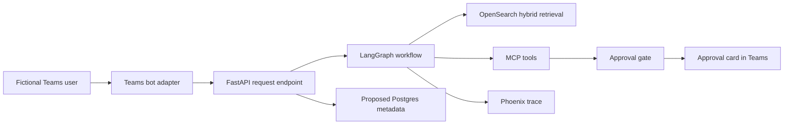

# Fictional Teams API Assistant Architecture Notes

> These notes describe a fictional Microsoft Teams bot integration for
> interview discussion. It is not connected to any tenant, user directory, or
> production messaging environment.

## Use Case

The Atlas API Assistant lets a fictional developer ask in Teams:

- "Which endpoint finds HCPs by specialty?"
- "Does submitting trial interest require approval?"
- "Show the runbook for a `503` from the trials sandbox."

It returns grounded answers from the synthetic corpus with source citations.
When a user requests a sensitive action, it creates an approval card rather
than invoking the action immediately.

## Logical Flow



## Message Handling

1. The adapter validates a fictional sandbox tenant identifier and assigns a
   correlation ID.
2. FastAPI creates conversation metadata without storing raw message secrets.
3. LangGraph retrieves documentation or chooses an MCP tool based on policy.
4. Read-only responses include a title, API version, and cited source.
5. Sensitive tool requests return a pending approval identifier and a
   structured review card.

## Example Approval Card Payload

```json
{
  "approval_id": "apr-syn-017",
  "action": "create_trial_interest_request",
  "api_name": "clinical_trials_api",
  "version": "2.1.0",
  "risk": "approval_required",
  "summary": "Submit fictional interest request for trial TRIAL-SYN-204",
  "data_classification": "synthetic_internal"
}
```

The card includes no real identity, patient detail, credentials, or live
action links.

## Operational Notes

- A proposed deployment would store conversation references, approval state,
  and evaluation results in Postgres, using invented test identities only.
- A proposed deployment would trace retrieval, graph decisions,
  tool-selection policy, and latency in Phoenix while excluding authorization
  headers.
- OpenSearch indexes metadata including `domain`, `owner`,
  `data_classification`, `system`, `api_name`, and `version`.
- The bot should respond with a refusal and escalation path for requests to
  bypass approvals or expose tokens.

## Interview Discussion Topics

- Explicit workflow state makes approval pauses resumable and auditable.
- MCP prevents chat-channel logic from becoming the tool integration boundary.
- Hybrid retrieval handles both exact endpoint names and conceptual governance
  questions.
- A chat surface increases convenience, but does not weaken action controls.
