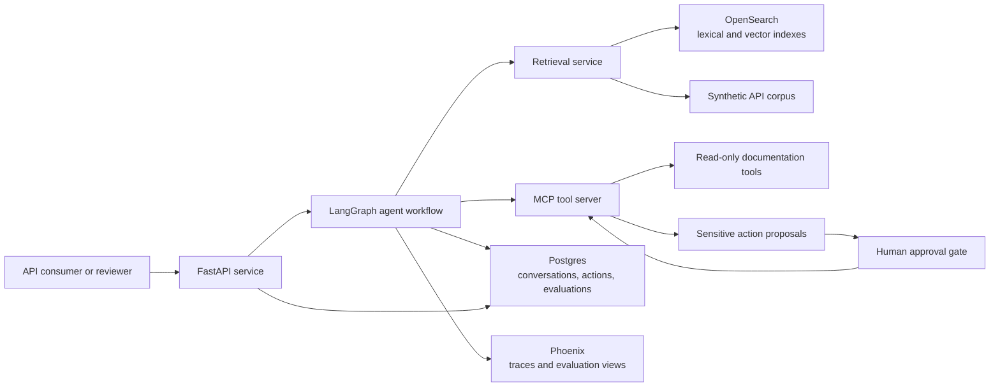
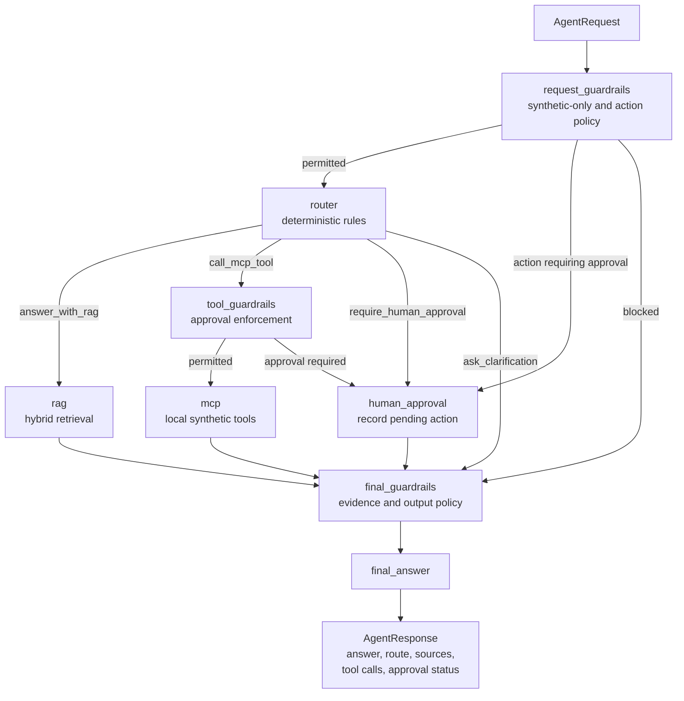

# Enterprise API Intelligence Agent: Architecture

## Purpose

Enterprise API Intelligence Agent is an enterprise-style reference project for answering questions about synthetic API documentation and proposing governed tool actions. It demonstrates retrieval, agent orchestration, approvals, and operational measurement without using internal or proprietary data.

## Design Principles

- Use synthetic OpenAPI specifications, Postman collections, and supporting documentation only.
- Keep reasoning workflows explicit, observable, and testable.
- Separate retrieval, tool execution, approval, persistence, and API delivery concerns.
- Store credentials and runtime settings in environment variables, never source code.
- Prefer a small working vertical slice before adding operational depth.

## System Context

## Component Boundaries

| Component | Responsibility | Key Boundary |
| --- | --- | --- |
| FastAPI backend | HTTP endpoints, validation, request context, health checks, approval endpoints | Does not own agent decision logic |
| LangGraph workflow | State transitions for question answering, retrieval, tool selection, approval, and final response | Calls services through typed interfaces |
| Retrieval service | Ingests and searches synthetic documentation; combines lexical and vector evidence | Returns cited passages, not agent answers |
| OpenSearch | Search indexes for documents, chunks, metadata, embeddings, and keyword fields | Search store, not transactional system of record |
| MCP server | Exposes controlled tools such as API lookup and proposed governed actions | Tool contracts are independent of model provider |
| Approval service | Suspends sensitive actions until an authorized human approves or rejects | No sensitive execution before approval |
| Guardrail policy | Blocks restricted requests, enforces tool approval, and checks evidence before answers | Synthetic-only and sourced-answer boundary |
| Agent repository | Conversation turns and pending mock approvals; currently in-memory for local use | Protocol boundary for a later Postgres adapter |
| Postgres | Planned durable conversation metadata, tool/audit events, approval status, and evaluation results | Durable operational record after adapter implementation |
| Phoenix | Trace visualization, retrieval and response evaluation, experiment comparison | Observability platform, not source of business records |
| Docker Compose | Reproducible local development services and dependency wiring | Development and demonstration deployment baseline |

## Primary Request Flow

1. A client submits a question to FastAPI with correlation and conversation context.
2. LangGraph first applies deterministic request guardrails, rejecting
   restricted disclosure and real-system access or sending change actions to
   approval.
3. The router decides whether retrieval, a local MCP tool, an approval gate,
   or clarification is needed.
4. For documentation questions, the retrieval service obtains candidate passages from OpenSearch using lexical and vector search, merges and ranks results, and returns citations.
5. Final guardrails require adequate sourced evidence before the workflow
   formats a deterministic evidence-based answer from
   retrieved synthetic sources; a configured LLM answer generator can be
   introduced later.
6. For MCP tool requests, tool guardrails enforce policy before the workflow
   invokes permitted tools and records inputs and results.
7. If a tool represents a sensitive action, LangGraph creates a pending
   approval record rather than invoking the tool.
8. `POST /agent/approve/{approval_id}` simulates approval and invokes only the
   local mock action, returning an object that explicitly creates no external
   record.
9. The current HTTP layer stores session and approval metadata in an in-memory
   repository implementation; a Postgres adapter remains a planned
   operational integration.
10. When `ENABLE_TRACING=true`, optional OpenTelemetry spans are exported to
   local Phoenix for the agent run and executed graph nodes.

## Implemented Graph Flow

The router backend is selected with
`API_AGENT_ROUTER_BACKEND="deterministic"`. The graph depends on the router
node contract rather than on rule implementation details, leaving a clear
configuration boundary for an LLM router in a later phase. This version does
not require an LLM API key or make an external model call.

## Architecture Decisions

### Why LangGraph

Agent workflows need explicit control over branching, tool calls, and pauses
for approval. LangGraph models these as typed state transitions, making each
path inspectable and testable even before an LLM is introduced. This is better
suited than an opaque prompt loop when an action must stop at a governance
boundary or preserve audit context across requests.

### Why MCP

MCP provides a standard tool boundary between the agent and capabilities it can invoke. A separate MCP server makes tool schemas discoverable, keeps authorization and audit policy outside prompt logic, and allows the same synthetic API tools to be exercised by different agents or clients. This is useful for API governance patterns because tools can advertise clear risk classifications and approval requirements.

### Why Hybrid RAG

API documentation contains both exact identifiers and semantic concepts. Lexical search is strong for endpoint paths, parameter names, error codes, and version strings. Vector search is strong for intent such as "how do I rotate credentials?" Combining them improves recall without losing precision on exact API terminology. Returned answers should cite the source chunks used.

### Why OpenSearch

OpenSearch supports keyword and vector retrieval in one operational service, together with metadata filtering for API name, version, environment label, or document type. It fits a production-style search architecture while remaining practical in Docker Compose for a synthetic demonstration corpus.

### Why Human Approval

Tool-using agents must distinguish reading information from actions with effects. Requests such as creating a credential rotation task, registering a consumer, or simulating a write should enter a pending state with visible proposed inputs, risk level, and audit trail. Approval is a control boundary, not a prompt instruction, and is enforced before sensitive tool execution.

### Why Tracing And Evaluation

Quality cannot be judged only by a successful HTTP response. Optional Phoenix
tracing makes workflow transitions, retrieval execution, tool use, approval
decisions, latency, and failures visible without making observability a runtime
dependency. Current spans retain operational metadata only; future evaluation
should measure groundedness, citation relevance, retrieval quality,
tool-selection correctness, and approval-policy compliance.

## Enterprise AI And AgentOps Mapping

| Enterprise concern | Architecture response |
| --- | --- |
| Knowledge grounding | Hybrid retrieval over versioned synthetic API artifacts with citations |
| Interoperable capabilities | MCP tools with explicit contracts and risk metadata |
| Governance and separation of duties | Human approval gate for sensitive tools |
| Data and answer policy | Guardrails blocking restricted access and unsupported factual responses |
| Auditability | Repository protocol for conversation and approval events, designed for Postgres durability |
| Operational visibility | Phoenix traces and evaluation datasets |
| Change management | Versioned prompts, schemas, corpora, and evaluation runs |
| Secure configuration | Environment variables and documented local configuration |
| Reproducibility | Docker Compose and automated tests |

This maps to AgentOps by treating prompts, retrieval, tool calls, approvals, traces, and evaluations as managed operational assets rather than hidden model behavior.

## Data And Security Boundaries

- The corpus contains invented API products, examples, OpenAPI specifications, and Postman collections.
- Secrets, model credentials, and connection strings are supplied through environment configuration and represented safely in `.env.example`.
- Tool events record redacted inputs and outcomes suitable for an audit trail.
- Approval records include request identity, action type, status, timestamps, and reviewer decision metadata.
- Authentication, authorization, redaction, retention, and production deployment hardening are design requirements for later implementation phases.

## Initial Deployment Shape

Docker Compose will coordinate the FastAPI application, MCP server, OpenSearch, Postgres, and Phoenix for local development and demonstration. The application code will retain clear interfaces so hosted search, managed Postgres, external identity, and a production tracing deployment can replace local services later.

## Non-Goals For The Initial Build

- Using real corporate documentation, live credentials, or production APIs.
- Automatically performing irreversible external actions.
- Claiming production security certification or organization-specific deployment readiness.
- Introducing complex multi-agent behavior before the governed single-agent workflow is reliable.
