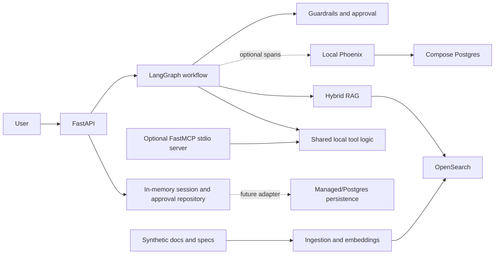
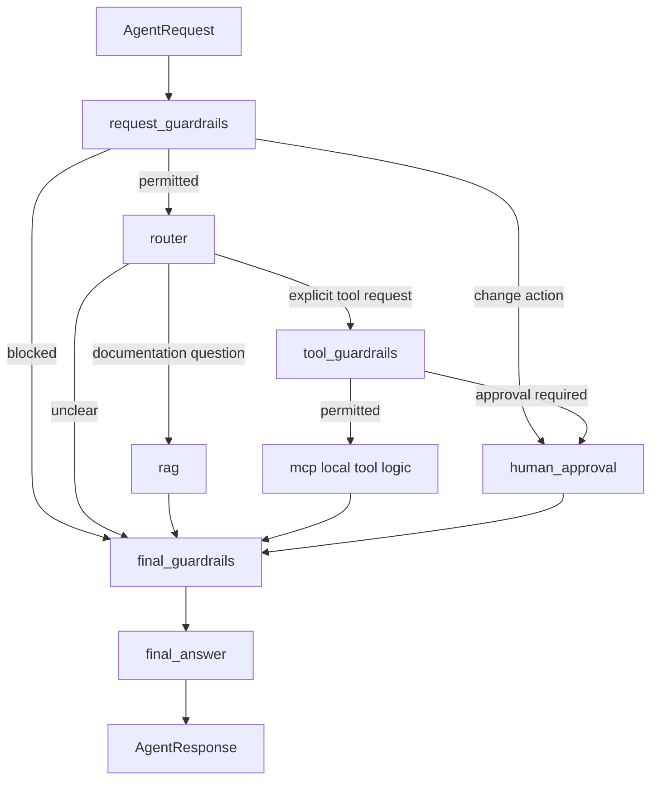

# Architecture

## Purpose

Enterprise API Intelligence Agent is an enterprise-style portfolio PoC
inspired by API governance, MCP/tooling, and regulated AI patterns. It answers
questions from a synthetic API corpus and demonstrates controlled local tools,
approval gating, tracing, and evaluation without access to real company data
or systems.

## Implemented Architecture

Docker Compose currently starts the API, OpenSearch, Postgres, and Phoenix.
The MCP stdio server is started separately and exposes the same local tool
logic used by the graph.

## Boundaries

| Component | Responsibility | Current Boundary |
| --- | --- | --- |
| FastAPI | Typed HTTP endpoints and validation | `/health`, `/rag/search`, and `/agent/*` |
| LangGraph | Deterministic route and control flow | No external LLM call |
| RAG layer | Chunk ingestion and keyword/vector/hybrid retrieval | Synthetic corpus only |
| OpenSearch | Search index for chunks, metadata, and vectors | Local development service |
| MCP-style tools | Catalogue lookup, spec validation, mock change request | No external system writes |
| Approval gate | Stops a mock governed action until explicit approval | In-memory local lifecycle |
| Guardrails | Blocks restricted requests and unsupported factual answers | Deterministic baseline controls |
| Phoenix | Optional traces for workflow paths and control outcomes | Metadata only; no prompt or chunk text |
| Postgres | Phoenix local storage in Compose | Application persistence is not implemented |

## Agent Flow

The router is intentionally deterministic and configured with
`API_AGENT_ROUTER_BACKEND="deterministic"`. An LLM router could later use the
same typed workflow boundary, but this PoC requires no external LLM API or
model key.

## Decisions And Trade-Offs

### LangGraph

LangGraph makes retrieval, tools, approval, clarification, and final policy
checks explicit state transitions. That structure is easier to test and
inspect than a single function-calling loop when actions must be stopped at a
control boundary.

### MCP-Style Tools

MCP exposes capabilities through typed contracts independent of prompts or a
particular model. The PoC keeps implementation local and synthetic: read tools
can return evidence, while `create_change_request_mock` remains
approval-gated and has no external side effect.

### Hybrid RAG And OpenSearch

API documentation contains exact identifiers such as endpoint paths and error
codes as well as conceptual guidance. BM25 supports exact terms; vector search
supports related wording; reciprocal-rank fusion combines both. OpenSearch
supports these modes and metadata filters in one local service.

### Human Approval And Guardrails

The graph distinguishes information retrieval from a change-style request.
Guardrails reject secret or real-system requests, require sourced evidence for
factual answers, and route the mock governed action through approval. These
controls demonstrate workflow policy; they are not a complete production
authorization or data-loss prevention layer.

### Tracing And Evaluation

Optional Phoenix spans show which workflow path ran, which tool was selected,
and whether approval was required without exporting message or document
payloads. A deterministic 20-case evaluation suite checks routes, evidence,
tool choice, approval behavior, and heuristic groundedness. Both are local
engineering signals, not evidence of production certification.

## AgentOps Mapping

| Enterprise AI concern | PoC implementation |
| --- | --- |
| Grounded answers | Versioned synthetic corpus, hybrid retrieval, returned sources |
| Controlled capabilities | Typed local MCP-style tools and approval-gated mock action |
| Safety boundary | Request, tool, and final-answer guardrails |
| Operational inspection | Optional Phoenix trace metadata |
| Regression quality | Offline synthetic evaluation suite and pytest |
| Repeatable setup | Environment configuration and Docker Compose |

Production requirements and deployment options are intentionally kept in
[production_readiness.md](production_readiness.md).
